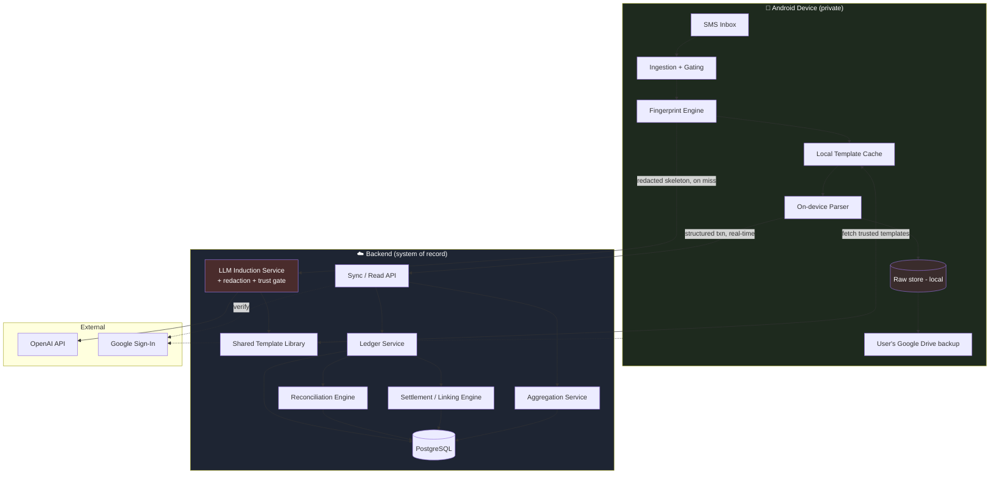
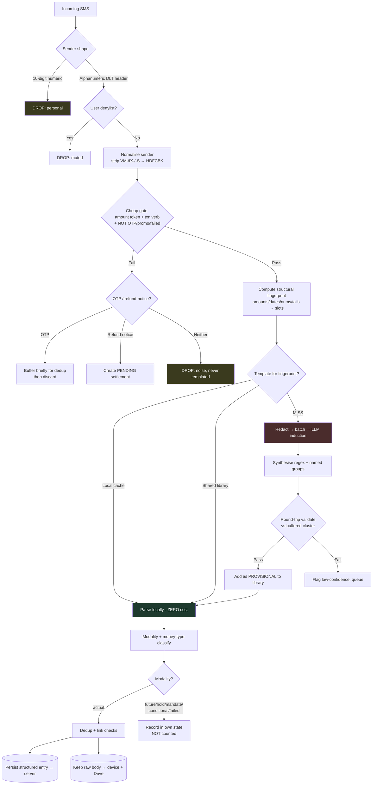
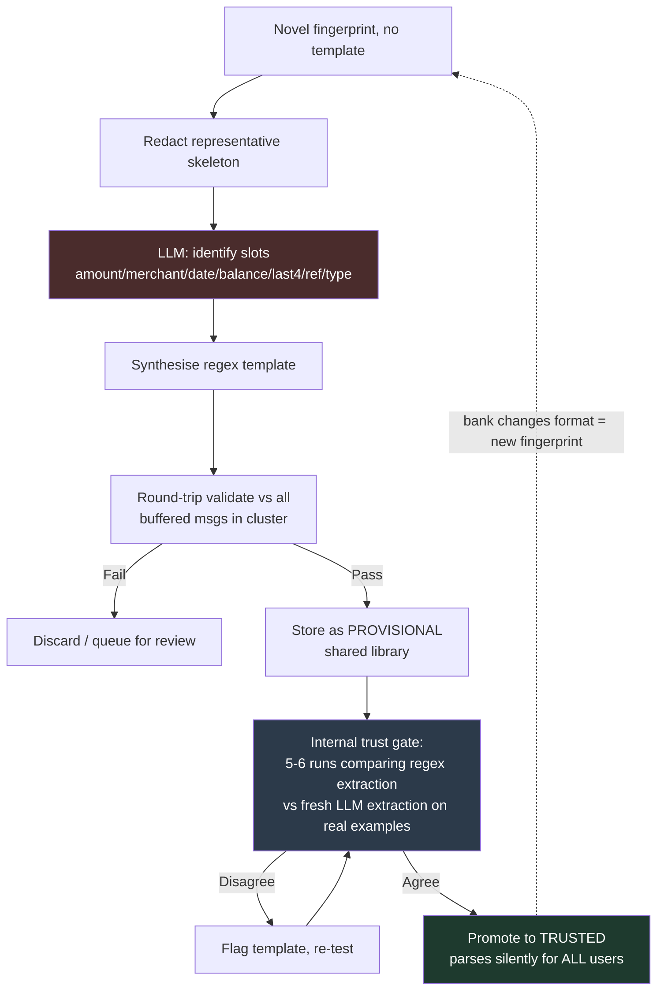
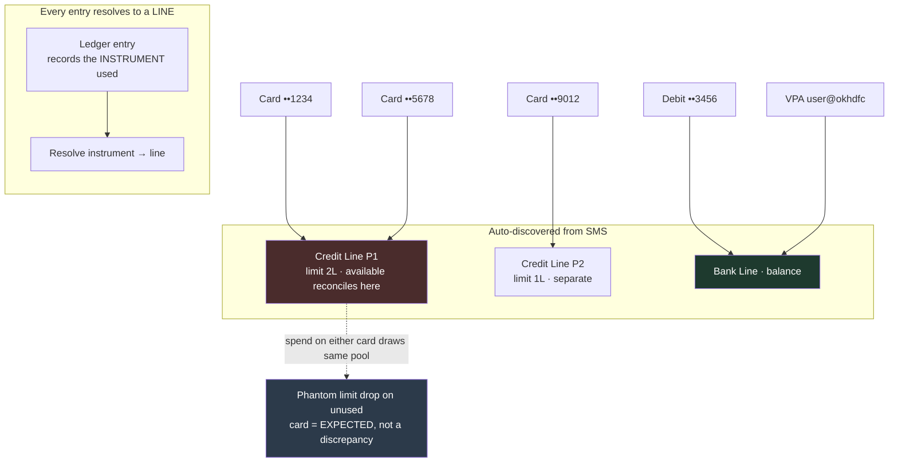
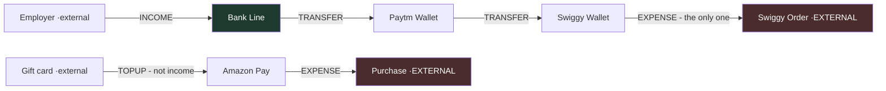
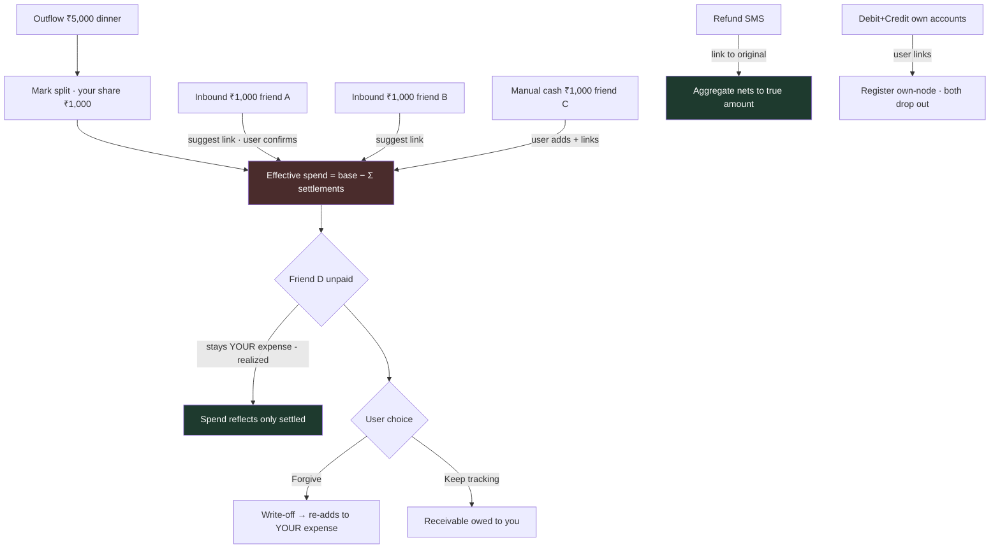
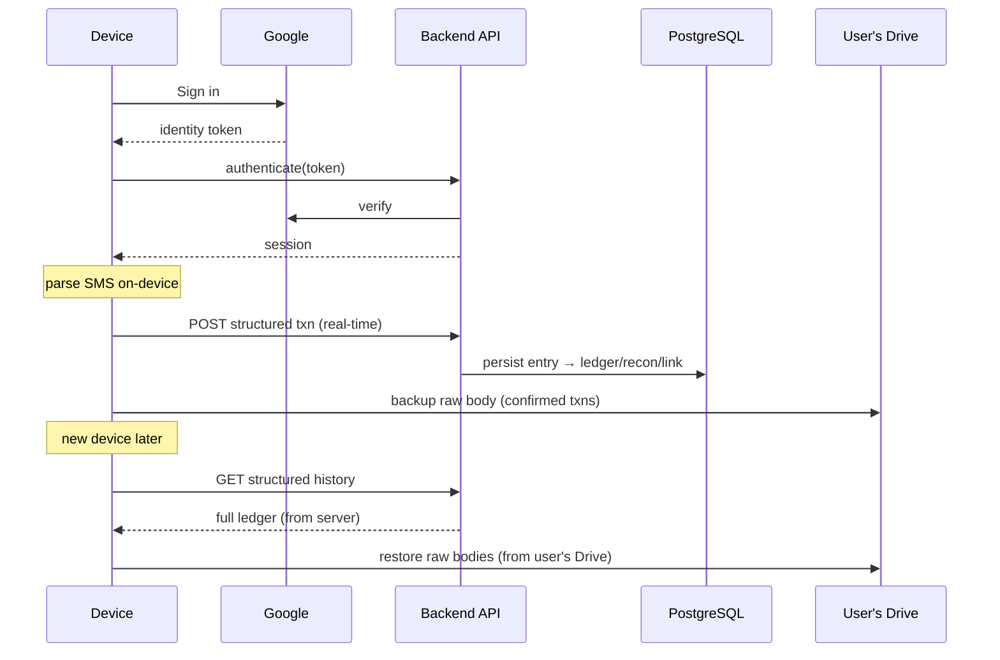

# Backend Design — AI Personal CFO (Android MVP)

> Concrete component design and data flows. Strategy/sequencing is in `02-backend-planning.md`; schema is in `04-database-design.md`.

---

## 1. System context



**Read this as:** raw stays left (device); only the two arrows crossing into the server carry data off the phone — the structured transaction (real values, but no raw text) and the redacted skeleton (no real values at all).

---

## 2. The ingestion pipeline (per SMS)



---

## 3. Template lifecycle (shared library + trust gate)



No versioning: a changed bank format is a new fingerprint and a fresh template. An existing working template is reused for its shape indefinitely.

---

## 4. The money model — lines & instruments



- Instruments are **auto-materialised** on first `(issuer, last4)` sighting.
- **Shared-limit detection:** two same-issuer credit instruments whose available-limits track each other → suggest a shared pool; **default to separate** until confirmed (under-merge is detectable & fixable; over-merge corrupts silently).
- **Missing last-4** → attribute to an "unattributed at \<issuer\>" bucket, never a guessed card.
- Strict **one-instrument-to-one-line**; EMI/loan is its own line the instrument references.

---

## 5. Money classification (the boundary)



Only `EXPENSE` and `INCOME` touch the headline numbers. `TRANSFER` and `TOPUP` move balances without affecting income/expense. Counterparty is resolved against the **own-node registry** (seeded for major wallets, learned via self-transfer/top-up linking).

---

## 6. Settlement / linking engine



Same engine, four entry points (refund / reimbursement / split / self-transfer). **Suggest-confirm-edit**; never silent when ambiguous. Aggregate view nets; ledger view keeps entries distinct.

---

## 7. Reconciliation engine

```mermaid
flowchart TD
    A[Entries with balance, per line] --> B[Sort by balance-implied order]
    B --> C{closing[n] == closing[n-1] ± amt?}
    C -->|Yes| OK[Chain holds · confidence up]
    C -->|No| D{Classify gap}
    D -->|Balance down, no debit| MO[MISSING_OUTFLOW]
    D -->|Balance up, no credit| MI{Interest-mode line?}
    MI -->|Yes & matches balance×rate| ABS[Absorb as interest income · silent]
    MI -->|No, or magnitude off| FLAG[Flag · ask user once]
    FLAG -->|User: it's interest| LEARN[Learn rate · enable interest-mode]
    D -->|Limit drop then monthly recover| EMI[SUSPECTED_EMI · offer liability]
    D -->|Same amt, tight window| DUP[SUSPECTED_DUPLICATE · offer merge]
    D -->|Credit after debit, same merchant| RF[SUSPECTED_REFUND · offer net]
    MO --> RES[User: label / add manual / ignore]
    RES --> DONE[(Resolution stored · confidence recomputed)]
    ABS --> DONE
    LEARN --> DONE

    style FLAG fill:#4a2c2c,color:#fff
    style ABS fill:#1e3a2e,color:#fff
    style DONE fill:#1e3a2e,color:#fff
```

Holds get a dip-then-recover state (not a missed txn). Card lines use inverted logic. Anchoring is forward-only from the first balance-bearing SMS, no opening-balance prompt.

---

## 8. Sync & continuity



Structured data is the server's responsibility (survives device loss); raw bodies are the user's (in their Drive). The two never mix.

---

## 9. Service responsibilities (summary)

| Service | Owns | Notes |
|---|---|---|
| **Sync/Read API** | Auth, ingest of structured txns, read endpoints | Real-time write; verifies Google identity. |
| **Template Library** | Shared fingerprint→template store, trust state | Provisional → trusted promotion. |
| **LLM Induction** | Redacted skeleton → slot map → regex; trust-gate runs | Only path off-device for derived data; OpenAI behind abstraction. |
| **Ledger** | Lines, instruments, entries; auto-discovery; classification | System of record for structured money. |
| **Reconciliation** | Balance chains, discrepancies, holds, interest-mode | Per-line confidence signal. |
| **Settlement/Linking** | Refund/reimburse/split/self-transfer links, effective amounts | Suggest-confirm-edit; write-off flips to expense. |
| **Aggregation** | The 3 numbers + breakdowns by category/tag/line | Nets linked entries; respects period-honesty. |

---

## 10. Failure & edge handling (design-level)

- **Redaction bug** → privacy breach: dual enforcement (device + server), highest test coverage.
- **Poisoned shared template** → provisional-until-corroborated trust gate.
- **Out-of-order SMS** → reconcile by balance-implied order, not receipt time.
- **Wallet-internal spend with no SMS** → wallet balances marked soft/estimated; flag stale top-ups.
- **Cross-source dedup** (future AA/email): `source_priority` so authoritative sources supersede inferred ones. Not in v1 but the entry carries a `source` discriminator now.
- **Cache-clear / device-switch** → structured restores from server, raw from user's Drive.
