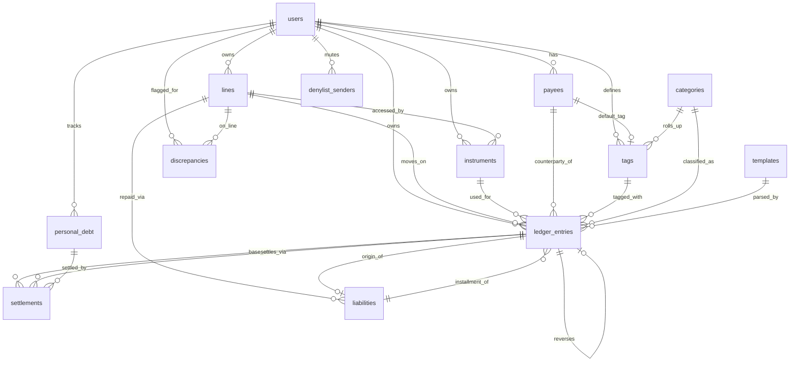

# Database Design & Architecture — AI Personal CFO (Android MVP)

> PostgreSQL schema for the server-side **system of record**. Raw SMS bodies are **not** in this database (they live device-local + user's Google Drive). This holds only **structured, derived** data.

---

## 1. Design principles

1. **Lines hold money; instruments access lines; entries record movement.** Three layers, never collapsed.
2. **Labels live on the entity (line/payee/wallet), never copied onto the transaction** — so renaming or re-tagging reflects across all history. Entries reference by id.
3. **Originals are never destroyed.** Parse corrections store both captured and edited values; reversals/settlements link rather than overwrite.
4. **The aggregate view nets; the ledger view is honest.** Netting is deterministic via explicit links, never guessed.
5. **Everything is auto-discovered.** A new account/card/wallet/payee is materialised on first sighting; the user confirms/renames, never creates from scratch.
6. **Source-aware from day one.** Every entry carries a `source` so future AA/email ingestion slots in without migration.

---

## 2. Entity-relationship overview

---

## 3. Core tables

### 3.1 `users`
| Column | Type | Notes |
|---|---|---|
| id | uuid PK | |
| google_sub | text unique | Google Sign-In subject id (the identity) |
| display_name | text | |
| email | text | |
| created_at | timestamptz | |
| backfill_window_days | int default 14 | configurable per-user (starts at 2 weeks) |
| drive_backup_enabled | bool | raw-body backup to user's Drive |

### 3.2 `lines` — the money-holding reality
A bank balance, a credit pool, or a wallet. **The only layer that reconciles.**
| Column | Type | Notes |
|---|---|---|
| id | uuid PK | |
| user_id | uuid FK | |
| kind | enum | `bank` · `credit_pool` · `wallet` · `loan` |
| issuer | text | normalised entity, e.g. `HDFCBK` (null for some wallets) |
| display_name | text | user-renamable, e.g. "HDFC Millennia pool" |
| current_balance | numeric | from latest balance-bearing SMS (bank/wallet) |
| credit_limit | numeric | credit pools only |
| available_credit | numeric | credit pools only (reconciles at POOL level) |
| is_own_node | bool default true | part of the user's boundary |
| balance_is_soft | bool | true for wallets (spend often emits no SMS) |
| accrues_daily_interest | bool default false | enables interest-mode reconciliation |
| interest_rate_daily | numeric | learned `credit ÷ balance`; null until confirmed |
| reconciliation_confidence | numeric | 0–1, per-line signal |
| anchor_balance | numeric | first balance-bearing value; chain starts here |
| anchored_at | timestamptz | |
| created_at | timestamptz | |

### 3.3 `instruments` — the access layer
A card, debit card or VPA. **Points at exactly one line.**
| Column | Type | Notes |
|---|---|---|
| id | uuid PK | |
| user_id | uuid FK | |
| line_id | uuid FK | the line this draws from |
| kind | enum | `credit_card` · `debit_card` · `vpa` · `netbanking` |
| issuer | text | |
| last4 | text | nullable; key on (issuer,last4,kind) — not globally unique |
| vpa | text | for UPI instruments |
| holder | text | "self" / "wife add-on" — user-assigned (SMS rarely says) |
| display_name | text | user-renamable |
| is_confirmed | bool | shared-limit / pooling confirmed by user |
| created_at | timestamptz | |

### 3.4 `categories` — fixed system taxonomy
The 12-ish roll-up buckets for the dashboard (Food, Shopping, Rent, Utilities, Travel, Healthcare, Entertainment, Investments, Education, Loans, Insurance, Miscellaneous). Seeded, read-mostly.
| Column | Type | Notes |
|---|---|---|
| id | int PK | |
| name | text | |
| is_system | bool | |

### 3.5 `tags` — the user's personal taxonomy
Free-form, **single-tag**, nested under one system category for roll-up.
| Column | Type | Notes |
|---|---|---|
| id | uuid PK | |
| user_id | uuid FK | |
| name | text | "smoke break", "tea stall" |
| category_id | int FK | the system category it rolls up to |
| created_by_user | bool | |
| created_at | timestamptz | |

> On creation, fuzzy-match against the user's existing tags to prevent "smoke / smoking / ciggarette" fragmentation. Deleting a tag must **reassign** its entries, never orphan them (keeps historical totals stable).

### 3.6 `payees` — UPI counterparty identity (per user)
Learn-once identity; the default label/tag auto-applies to future payments.
| Column | Type | Notes |
|---|---|---|
| id | uuid PK | |
| user_id | uuid FK | |
| normalized_key | text | join key (phone or name local-part, PSP-stripped) |
| raw_vpas | text[] | all observed VPAs mapping to this payee |
| display_name | text | "Ramesh tea stall" |
| default_category_id | int FK | |
| default_tag_id | uuid FK | the **one** default tag |
| counterparty_type | enum | `merchant` · `person` · `own_node` · `unknown` |
| is_user_confirmed | bool | |
| created_at | timestamptz | |

### 3.7 `ledger_entries` — every money movement
The central table. **Real values live here; raw text does not.**
| Column | Type | Notes |
|---|---|---|
| id | uuid PK | |
| user_id | uuid FK | |
| line_id | uuid FK | resolved line |
| instrument_id | uuid FK | instrument used (nullable → "unattributed at issuer") |
| payee_id | uuid FK | UPI counterparty (nullable) |
| message_id | text | device-side SMS id (links to raw on device/Drive) |
| direction | enum | `EXPENSE` · `INCOME` · `TRANSFER` · `TOPUP` |
| modality | enum | `actual` · `future` · `conditional` · `failed` · `hold` · `mandate` |
| amount_captured | numeric | exactly what we parsed from SMS — **never overwritten** |
| amount_effective | numeric | after parse-correction and/or settlements |
| balance_after | numeric | closing balance if SMS carried one (nullable) |
| category_id | int FK | system category |
| tag_id | uuid FK | the single tag (defaulted from payee, overridable) |
| merchant_text | text | extracted merchant string (no PII beyond merchant) |
| txn_time | timestamptz | transaction time |
| received_at | timestamptz | SMS receipt time (may differ → reconcile by balance order) |
| source | enum | `sms` · `cash` · `manual` · (future: `aa`,`email`,`statement`) |
| net_status | enum | `active` · `reversed` · `is_reversal` · `settled` |
| reverses_entry_id | uuid FK | → original entry (for refunds/reversals) |
| is_counted | bool | false for future/hold/mandate/failed/transfer/topup |
| template_id | uuid FK | which template parsed it (nullable for manual/cash) |
| created_at | timestamptz | |

**Aggregation rule:** headline numbers sum entries where `is_counted = true` AND `net_status NOT IN ('is_reversal')`, using `amount_effective`, and **subtract linked settlements** so refunds/reimbursements/splits net correctly. Reversals and fully-reversed pairs drop out together; partials net by amount.

### 3.8 `settlements` — the linking engine
One row per link between a base entry and a settling entry. Powers refunds, reimbursements, splits, self-transfers.
| Column | Type | Notes |
|---|---|---|
| id | uuid PK | |
| user_id | uuid FK | |
| base_entry_id | uuid FK | the outflow (or inflow) being settled |
| settle_entry_id | uuid FK | the inflow/refund/cash entry that settles it (nullable for pure expected) |
| kind | enum | `refund` · `reimbursement` · `split` · `self_transfer` |
| expected_amount | numeric | for pending/announced settlements |
| settled_amount | numeric | actual |
| status | enum | `pending` · `partial` · `settled` · `written_off` |
| expected_at | timestamptz | for refund aging (5–30 days) |
| personal_debt_id | uuid FK | nullable → receivable/payable created |
| note | text | user comment ("₹1,000 my share, ₹1,000 bad loan") |
| created_at | timestamptz | |

> **Write-off** (`status='written_off'`) flips the unsettled amount back into the user's expense. **Realized accounting:** `amount_effective` of the base reflects only `settled` portions; the rest stays as the user's spend.

### 3.9 `liabilities` — loans & card EMIs
Both are "a liability with a repayment schedule"; they differ only by pointers.
| Column | Type | Notes |
|---|---|---|
| id | uuid PK | |
| user_id | uuid FK | |
| kind | enum | `loan` · `card_emi` |
| repaid_via_line_id | uuid FK | bank line (loan) or credit pool (card EMI) |
| origin_entry_id | uuid FK | the original purchase (card EMI) → so it's not re-counted; null for cash loans |
| principal | numeric | user-declared or derived |
| tenure_months | int | |
| installment_amount | numeric | |
| remaining | numeric | |
| is_user_declared | bool | MVP: liabilities are user-declared; reconciliation assists |
| created_at | timestamptz | |

> MVP stance: we **do not** invent EMI interest splits the SMS didn't give us. Liabilities are user-declared; matching EMI-payment SMS to a declared liability is suggest-confirm, then auto-apply future matches.

### 3.10 `personal_debt` — informal lend/borrow (medium schema, minimal v1 UI)
| Column | Type | Notes |
|---|---|---|
| id | uuid PK | |
| user_id | uuid FK | |
| counterparty_name | text | |
| direction | enum | `they_owe_me` · `i_owe_them` |
| principal | numeric | |
| remaining | numeric | |
| status | enum | `open` · `partial` · `closed` · `forgiven` |
| origin_purpose | text | nullable (the borrow's purpose = the real spend; deferred) |
| created_at | timestamptz | |

### 3.11 `discrepancies` — reconciliation gaps as first-class objects
| Column | Type | Notes |
|---|---|---|
| id | uuid PK | |
| user_id | uuid FK | |
| line_id | uuid FK | |
| type | enum | `missing_outflow` · `missing_inflow` · `suspected_emi` · `suspected_duplicate` · `suspected_refund` · `suspected_interest` |
| magnitude | numeric | the ₹ gap |
| status | enum | `open` · `resolved` · `ignored` |
| resolution | enum | `labelled` · `manual_added` · `merged` · `netted` · `interest_confirmed` · `ignored` |
| created_at | timestamptz | |

> Every discrepancy has an "ignore / it's cash" path — acknowledged gaps, not zero gaps.

---

## 4. Supporting tables

### 4.1 `templates` — shared library (server)
| Column | Type | Notes |
|---|---|---|
| id | uuid PK | |
| fingerprint | text unique | structural hash (sender-normalised skeleton) |
| issuer | text | for O(few) matching |
| regex | text | named-group extraction pattern |
| slot_map | jsonb | which group → amount/merchant/date/balance/last4/ref/type |
| trust_state | enum | `provisional` · `trusted` · `flagged` |
| validation_runs | int | the 5–6-pass agreement count |
| created_at | timestamptz | |

> **No versioning** — a changed format yields a new fingerprint → a new row. Templates are **shared across all users**; redaction guaranteed before anything is contributed.

### 4.2 `denylist_senders` — per-user muted senders
| Column | Type | Notes |
|---|---|---|
| id | uuid PK | |
| user_id | uuid FK | |
| sender_normalized | text | |
| created_at | timestamptz | |

---

## 5. What is deliberately NOT in this database

- **Raw SMS bodies** — device-local + user's Google Drive only. Linked by `message_id`.
- **OTP / promo / dedup-buffer text** — discarded after use; never persisted.
- **Redacted skeletons** beyond what the shared `templates` table needs — induction is transient.
- **AI suggestions / insights / health scores** — deferred until real data exists.
- **Goals** — deferred to v2 (schema seam left so it bolts on without migration).

---

## 6. Key invariants (must always hold)

1. `amount_captured` is **immutable** once set from SMS; corrections write `amount_effective`, both retained.
2. An `EXPENSE` is any counted entry whose counterparty/`to` is **not** an own-node line — the core anti-double-count rule.
3. A `TRANSFER` or `TOPUP` is **never** counted toward income or expense.
4. The sum of by-tag spend = by-category spend = grand total (single-tag guarantee).
5. A refund/settlement **nets** the base in aggregate but both rows survive in the ledger.
6. Reconciliation chains **forward from the anchor**; no opening balance is ever requested.
7. Anything the LLM touches carries **zero real values**.
