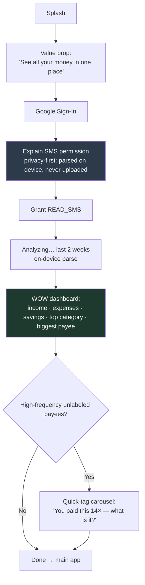
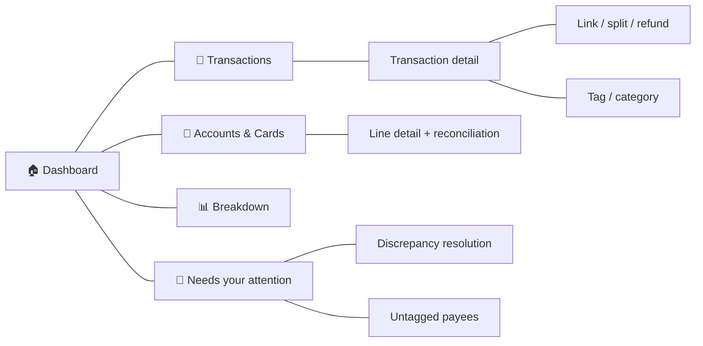
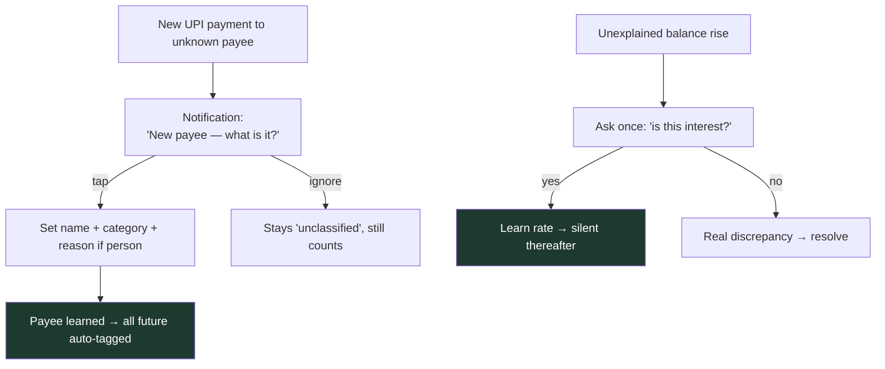

# Frontend Screens — AI Personal CFO (Android MVP)

> Android-first (Flutter or React Native), dark-mode supported, mobile-first. Screens map directly to the backend decisions; nothing here implies data we can't see.

---

## 1. Design principles

1. **The wow-moment is the whole onboarding.** Permission → analysis → dashboard, fast. The first dashboard must feel like a revelation, not a setup form.
2. **Period-honest copy everywhere.** With a 2-week backfill, always say *"since you installed"* — never imply a full month. Income may legitimately read near-zero on a fresh mid-cycle install; the copy must make that feel correct, not broken.
3. **Suggest, don't nag.** Tagging, linking and discrepancy resolution are surfaced as gentle, dismissible prompts — never blocking modals. Untagged still counts (as "uncategorised"), so numbers are never wrong, just less granular.
4. **Two views, one truth.** The **ledger** is honest (refunds, splits and their settlements all visible). The **aggregate/dashboard** nets them. Never show a phantom +200/−200 pair in totals.
5. **The user is the final authority.** Anything uncertain is editable; edits never destroy the captured original.

---

## 2. Onboarding flow

**Screen-by-screen:**

| # | Screen | Purpose / key copy |
|---|---|---|
| O1 | **Splash** | Brand, one line: *"All your accounts. One honest picture."* |
| O2 | **Value prop** | 2–3 cards: all accounts in one place · no bank login ever · parsed on your phone. |
| O3 | **Google Sign-In** | Single tap. Explains it also enables cross-device backup. |
| O4 | **Permission primer** | *Before* the system dialog: why SMS, and the promise — *"We read transaction texts on your phone. The raw messages never leave it."* |
| O5 | **System permission** | Android `READ_SMS` dialog. |
| O6 | **Analyzing** | Progress with reassuring on-device framing; parses 2 weeks. |
| O7 | **First dashboard (the WOW)** | The three numbers + top category + biggest payee + current balances, labelled *"since you installed."* |
| O8 | **Quick-tag** | Optional carousel of high-frequency payees, one tap each, retroactively labels all their transactions. Skippable. |

---

## 3. Main app — screen map

---

## 4. Core screens

### S1 — Dashboard (home)
The three headline numbers (**income · expenses · savings**) for *"since you installed."* Below: current net position across all lines, a top-spending-category strip, biggest payee, and a compact "needs attention" count (untagged payees + open discrepancies). Tapping any number drills into the breakdown.

- **Period-honest banner** if window is thin: *"Showing the last 2 weeks since install. Your full picture builds as you go."*

### S2 — Transactions (ledger)
Honest, chronological list across **all** accounts. Each row: amount, payee/merchant, line/instrument badge, category/tag, and a status chip (refund-linked, split, pending-refund, transfer, self-transfer). Refund and its original both appear; a split shows your effective share. Filter by line, category, tag, direction.

### S3 — Transaction detail
Everything about one entry plus its actions:
- **Tag / category** — single-tag picker (existing tags first, create-new with fuzzy-match warning). Overriding here changes only this entry, not the payee default.
- **"This amount is wrong"** (parse correction) vs **"Part of this wasn't mine"** (split) — **two distinct actions**, both preserve the captured original.
- **Link** — attach refunds, reimbursements, or split settlements (UPI or cash). Suggested matches shown first.
- For a **person payee:** a *reason* prompt (my share / lent / repaying / transfer) that routes the accounting.

### S4 — Link / split sheet
- **Split:** set your share; the rest becomes expected inbounds. As friends pay (or you add cash settlements), each links; the dashboard reflects only **realized** settlement. Unpaid remainder stays your expense; a comment lets you mark "₹1,000 bad loan." Option to **forgive** (re-adds to your spend) or **keep tracking**.
- **Refund:** link to original; aggregate nets. Pending refunds show an aging countdown (5–30 days) and auto-match when the credit lands, possibly on a different line/wallet.
- **Self-transfer:** suggested debit+credit pair; confirming links them and **registers the account as your own** for next time.

### S5 — Accounts & Cards
Auto-discovered lines and instruments, grouped by issuer. Shows shared-limit pools (two cards under one limit), current balances, available credit (pool-level only for shared cards). Entry points to:
- **Confirm shared limit** ("These two HDFC cards look pooled — correct?").
- **Rename / assign holder** ("wife's add-on").
- **Mark interest-earning** (or this surfaces automatically on the first detected drift).

### S6 — Line detail & reconciliation
Per-line balance history and reconciliation confidence. Surfaces discrepancies for *this* line with their resolution paths. For interest-mode lines, shows learned-rate interest as income ("you earned ₹312 in interest").

### S7 — Breakdown
Spend by **category** (system roll-up), by **tag** (the user's personal slice — "smoke breaks: ₹1,800"), and by **account/card/wallet**. Because tags are single, all three views reconcile to the same total. No AI suggestions in v1 — this is descriptive analytics only.

### S8 — Needs your attention
A single inbox of gentle, dismissible prompts:
- Untagged high-frequency payees (one-tap label).
- Open discrepancies (it's interest? it's cash? add manual entry? ignore?).
- Suggested links (refund/reimbursement/split/self-transfer) awaiting confirm.
- Pending refunds aging out.

### S9 — Add manual / cash entry
For spends and settlements the SMS never captured. Cash **settlement** links to an expense; cash **spend** lands in Miscellaneous (counts toward totals, never forced to itemise). ATM withdrawals appear as a single Misc outflow with an optional (v2) "itemise later."

### S10 — Settings
Google account / backup status (Drive), backfill window, denylist (muted senders), privacy explainer, dark mode.

---

## 5. Key interaction patterns

- **Bare phone-number VPA:** prompt via notification to classify; if ignored, keep the VPA and mark **unclassified** (does not silently count as spend until resolved).
- **Person payee reason** routes to expense / receivable / debt-repayment — and supports "my share + bad loan" annotations.
- **Tag reuse** offered first on every label action to keep the personal taxonomy clean.

---

## 6. What the UI must never do

- Never show a **net-distorting** +200/−200 pair in totals (ledger yes, aggregate no).
- Never **block** the user with a mandatory tagging/linking modal.
- Never imply a **full month** when only 2 weeks exist.
- Never **overwrite** a captured amount for attribution (that's a split, not a correction).
- Never present **AI advice/suggestions** in v1 — descriptive only.
- Never suggest the raw messages are uploaded — they are not.
