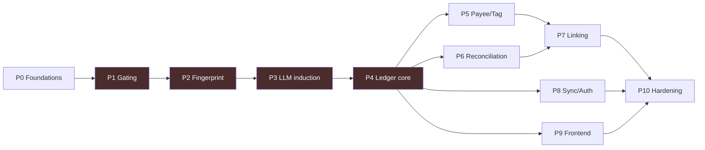

# Executable Task List — AI Personal CFO (Android MVP)

> Sequenced so each phase is testable against real SMS dumps before the next begins. The **critical path is Phases 1–4** (capture data correctly); everything after is analysis on top of correct data. Checkboxes are work items, not story points.

---

## Phase 0 — Foundations & de-risking

- [ ] **Validate Google Play `READ_SMS` policy** for this exact use case *before* committing — this is the existential risk. Document the approved-use justification (on-device parsing, no upload).
- [ ] Confirm on-device parsing satisfies the policy posture; write the permission-primer copy.
- [ ] Stand up repo, CI, environments (Node.js + TypeScript backend, PostgreSQL, Flutter/RN app).
- [ ] Provision OpenAI API access behind a **swappable provider abstraction**.
- [ ] Set up Google Sign-In (Firebase Auth or direct) — identity + Drive scope.
- [ ] **Collect a real SMS dump corpus** (volunteer devices, multiple banks/wallets) — the single most valuable test asset. Everything in Phases 1–3 is validated against it.

---

## Phase 1 — Ingestion & gating (on-device)  ⚙️ critical path

- [ ] Sender normalisation: strip operator prefixes/suffixes (`VM-`/`IX-`/`-S`) → registered entity (`HDFCBK`).
- [ ] Drop rule: 10-digit numeric senders (personal) → ignore always.
- [ ] Per-user denylist check.
- [ ] **Rule-based cheap gate:** amount token + transaction verb, NOT OTP/promo/failed intent. Microsecond, no model.
- [ ] OTP / refund-notice short-lived buffer (for dedup + pending-refund seeding); discard raw after use.
- [ ] **Living rule-set harness:** run gate over the dump corpus, measure false-pass/false-drop, iterate. Build this as a repeatable test, not a one-off.
- [ ] Decide buffer retention window (default ~7 days), structured-result-only persistence.

**Exit test:** gate correctly admits transactions and rejects OTP/promo across the full corpus, with a documented error rate.

---

## Phase 2 — Fingerprinting & template store  ⚙️ critical path

- [ ] Structural fingerprint: mask amounts/dates/numbers/account-tails → slot tokens; hash skeleton.
- [ ] Local template cache (device) + shared template library schema (server).
- [ ] Template matching: local → shared library → miss. Key by normalised issuer for O(few) lookup.
- [ ] **Hand-seed** 10–20 templates for the biggest banks/wallets to bootstrap before LLM is wired.
- [ ] Named-group regex extraction → structured fields.

**Exit test:** hand-seeded templates parse their bank's messages in the corpus with correct field extraction.

---

## Phase 3 — LLM induction, redaction & trust gate  ⚙️ critical path

- [ ] **Redaction module** — strip ALL real values from the skeleton (amounts, names, tails, balances). Enforce on-device AND server-side.
- [ ] **Redaction test suite** — the highest-coverage tests in the codebase; a leak here is a privacy breach. Include adversarial cases.
- [ ] Cluster unmatched messages by fingerprint; pick one representative per cluster.
- [ ] Batched LLM induction call → slot map → synthesise regex.
- [ ] Round-trip validation against all buffered messages in the cluster before storing.
- [ ] Store as **provisional**; **trust gate** = 5–6 internal runs comparing regex extraction vs fresh LLM extraction; agree → **trusted**, disagree → **flagged + re-test**.
- [ ] No versioning: changed format → new fingerprint → new template.

**Exit test:** a never-seen bank format is induced, validated, promoted, and parses locally for free thereafter — with redaction verified to leak nothing.

---

## Phase 4 — Ledger core  ⚙️ critical path

- [ ] `lines`, `instruments`, `ledger_entries`, `categories` tables + migrations.
- [ ] **Auto-discovery:** materialise a line/instrument on first `(issuer, last4/vpa)` sighting.
- [ ] Instrument→line resolution; one-instrument-to-one-line; "unattributed at issuer" bucket for missing last-4.
- [ ] **Money-type classification:** EXPENSE / INCOME / TRANSFER / TOPUP via own-node registry (seed major wallets).
- [ ] **Modality classification:** actual / future / conditional / failed / hold / mandate. Only `actual` counts.
- [ ] `amount_captured` (immutable) vs `amount_effective`; `is_counted` flag; `source` discriminator.
- [ ] Headline aggregation: income, expenses, savings using counted entries.

**Exit test:** the `Bank → Paytm → Swiggy → order` chain produces exactly ONE expense; a declined/scheduled/mandate SMS produces zero counted spend.

---

## Phase 5 — Payee identity & tagging

- [ ] `payees` table; VPA normalisation (PSP-stripped local-part as join key); raw-VPA aliasing.
- [ ] Cold-start best-guess (phone-VPA → person/unclassified; merchant-string → category hint; dictionary for big chains).
- [ ] **Learn-once labelling:** payee default category + single default tag; auto-apply to future payments.
- [ ] `tags` table; single-tag enforcement; fuzzy-match on creation; safe delete (reassign, never orphan).
- [ ] Per-transaction tag override that does NOT change payee default.
- [ ] **P2P vs P2M** resolution; bare phone-VPA → unclassified (not silently counted as spend).
- [ ] Person-payee **reason** prompt (share / lent / repaying / transfer) routing accounting.

**Exit test:** tagging a payee once retroactively labels its history; by-tag totals reconcile exactly to by-category totals.

---

## Phase 6 — Reconciliation

- [ ] Per-line balance chain `closing[n] = closing[n-1] ± amount[n]`; forward-anchor from first balance SMS (no opening-balance prompt).
- [ ] Reconcile by **balance-implied order** when receipt time conflicts.
- [ ] `discrepancies` table + typed gap classification + per-line confidence.
- [ ] **Credit-card inverted logic**; shared-pool reconciliation (spend on either card draws the pool; phantom drop on unused card = expected).
- [ ] **Hold/settlement** state (dip-then-recover ≠ missed txn).
- [ ] **Daily-interest mode:** detect drift → ask once → learn `rate = credit ÷ balance` → absorb future drips proportionally as interest income → magnitude-check periodically → re-flag if wildly off.
- [ ] Discrepancy resolution paths (label / manual / merge / net / ignore).

**Exit test:** a Slice-style daily-interest account stops throwing false missing-inflow flags after one confirmation; a shared-limit card pool reconciles without false alarms.

---

## Phase 7 — Settlement / linking engine

- [ ] `settlements` table; effective-amount = base − Σ settled.
- [ ] **Refund** linking (full + partial); aggregate nets, ledger keeps both; pending-refund aging + auto-match (incl. cross-line/wallet landing).
- [ ] **Reimbursement** (1:1) linking — ship in v1; inbound not auto-tagged, suppressed from income when linked.
- [ ] **Split** (1:many) — schema in v1; full multi-settlement UI as fast-follow. Realized accounting; unpaid stays user's expense; **forgive → re-adds to spend**; "my share + bad loan" annotation.
- [ ] **Self-transfer** linking → registers own-node for future auto-classification.
- [ ] Suggest-confirm-edit everywhere; manual/cash settlements supported.
- [ ] `liabilities` + `personal_debt` tables (built; minimal v1 UI); EMI-payment suggest-then-auto-apply.

**Exit test:** a ₹5,000 split where 3 of 4 pay (one in cash) yields the correct realized spend; a refund nets out of the category total but both rows remain visible.

---

## Phase 8 — Sync, auth & continuity

- [ ] Google Sign-In end-to-end; session/identity keyed to `google_sub`.
- [ ] **Real-time** structured-txn sync (device → server).
- [ ] Raw-body retention: device-local + **user's Google Drive** backup (confirmed txns only); restore-on-new-device flow.
- [ ] Verify cache-clear / device-switch: structured restores from server, raw from user's Drive.
- [ ] Raw-retention **config seam** for future policy change.

**Exit test:** clear app data → dashboard fully restores from server; new device → structured history present, raw bodies restore from the user's Drive.

---

## Phase 9 — Frontend (parallelisable from Phase 4 onward)

- [ ] Onboarding O1–O8 incl. permission primer + the WOW dashboard + quick-tag carousel.
- [ ] S1 Dashboard (3 numbers, period-honest copy).
- [ ] S2 Transactions ledger (all-accounts, status chips).
- [ ] S3 Transaction detail (tag, correction-vs-split distinction, link).
- [ ] S4 Link/split sheet (refund/reimbursement/split/self-transfer).
- [ ] S5 Accounts & Cards (shared-pool confirm, holder, interest flag).
- [ ] S6 Line detail & reconciliation.
- [ ] S7 Breakdown (category / tag / account — descriptive only).
- [ ] S8 Needs-your-attention inbox.
- [ ] S9 Add manual / cash entry.
- [ ] S10 Settings (backup, denylist, backfill window, privacy, dark mode).
- [ ] Dark mode throughout.

---

## Phase 10 — Hardening & launch

- [ ] Redaction audit (independent review of the only off-device path).
- [ ] Reconciliation accuracy benchmark against a hand-labelled corpus.
- [ ] Double-count regression suite (wallet chains, card-bill, refund pairs, self-transfers).
- [ ] Performance: ingestion throughput, sync latency, aggregation query cost at volume — revisit the **2-week window** with real numbers.
- [ ] Privacy-policy + in-app privacy copy review (DPDP-aligned).
- [ ] Play Store listing + permission declaration + closed beta with the dump-corpus volunteers.

---

## Explicitly deferred (do NOT build in v1)

- AI insights / suggestions / advice / monthly AI review / financial health score.
- Money Roast.
- Financial goals (leave schema seam).
- Automatic self-transfer detection (v1 uses user-confirmed linking).
- Cash-withdrawal itemisation.
- Account Aggregator / email ingestion / iOS (build ingestion as an adapter so these slot in later).
- Deep personal-debt analytics & borrow-purpose attribution.
- Google-Drive-as-primary-store (own DB for v1).
- Phone-OTP auth (Google-only for v1).

---

## Dependency map

The four red nodes are the critical path: until SMS becomes correct structured data, nothing downstream can be trusted.
