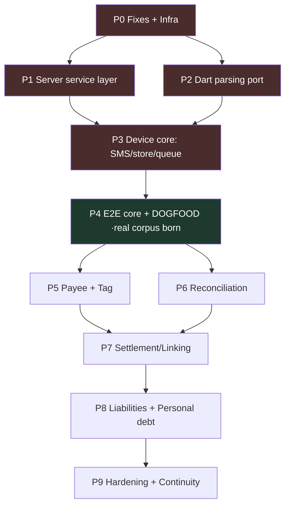

# Backend Completion Plan — AI Personal CFO (Android MVP)

> The sequenced plan to take the current state (domain engine + schema, no running service, synthetic corpus) to a complete, deployed, real-data-validated backend + the device-side parsing layer.
> Companion to docs 01–09. Where this conflicts with an earlier doc on a *decision*, this plan wins (it post-dates them).

---

## 0. Locked architecture decisions (the basis for everything below)

- **Native Flutter Android app**, distributed as a **sideloaded APK** to friends/family for now. SMS access via runtime permission. No PWA (a PWA cannot read SMS). Play Store distribution is a *later* decision, not a v1 blocker.
- **On-device parsing in Dart.** The gate / parseAmount / fingerprint / redact / apply-template logic is **ported from the existing TypeScript `@finman/engine` to Dart** so it runs on the phone. Raw SMS **never leaves the device**.
- **Server-side in TypeScript** (NestJS + Prisma) for everything that is *not* raw-message parsing: shared template library, LLM induction, trust-gate, ledger / reconciliation / settlement / aggregation, auth, and the read APIs.
- **The TS engine becomes the reference spec.** Its existing tests become **golden vectors** the Dart port must match exactly. The two implementations are kept in sync via shared test fixtures (see §3).
- **Offline-first, durable queue.** Known templates parse fully offline on-device. Unknown formats queue and resolve via the server when connectivity returns. Nothing is lost, only delayed.
- **Infra:** AWS **EC2 + PM2** for the Node app, **RDS PostgreSQL** for the database. No ECS/Kubernetes.
- **All v1 features in scope**, built in dependency order, with the core path **dogfooded on the real inbox early** so advanced features are validated against real data.

---

## 1. Responsibility split (device vs server)

| Responsibility | Where | Language | Notes |
|---|---|---|---|
| Read SMS (realtime + launch sweep) | Device | Dart + native Android | BroadcastReceiver + catch-up scan |
| Gate / parseAmount / fingerprint / redact | Device | Dart (ported) | Runs offline; raw never leaves phone |
| Apply **known** template | Device | Dart | Cached templates → instant local parse |
| Local store (raw, template cache, queue) | Device | Dart + SQLite | Durable; survives restart/reboot |
| Offline queue + retry/backoff | Device | Dart | pending-parse, pending-sync |
| Drive backup of raw bodies | Device | Dart | User's own Google Drive |
| Sync structured entries → server | Device → Server | — | Idempotent upsert |
| Induce **unknown** template (redacted skeleton in) | Server | TS | Only the skeleton crosses the wire |
| Shared template library + trust-gate | Server | TS | One template serves all users |
| Idempotent upsert / dedup | Server | TS | UUIDv5 key + reference-based dedup |
| Ledger / reconciliation / settlement / aggregation | Server | TS | System of record |
| Auth (Google ID token verify) | Server | TS | Never trust client-asserted identity |
| Read APIs (dashboard, ledger, breakdown) | Server | TS | What the app renders |
| Hosting | AWS EC2 + PM2 | — | RDS for Postgres |

**The boundary rule:** the device decides *what a message means* (privately, offline-capable); the server is the *system of record* and does all cross-account math. The only message-derived thing that ever crosses to the server is a **redacted skeleton** (zero real values) for induction.

---

## 2. Pre-work — fix the two foundational bugs FIRST  🔴

These change how every transaction is keyed and stored. Building the service layer or the Dart port on top of the broken versions means re-testing everything later. Fix before anything else.

### 2.1 Fingerprint merchant-masking bug
- **Problem:** the masker masks amount/date/balance but **not the merchant**, so `Rs 450 at Zomato` and `Rs 600 at Swiggy` get *different* fingerprints → different templates → one LLM induction per merchant → template explosion, cost moat broken.
- **Fix:** fingerprint on the **fixed DLT boilerplate** ("spent at", "debited for", "Avl Bal") and treat the free-text spans between anchors (merchant, etc.) as **wildcard slots** masked to `§MERCHANT§`. The skeleton's *structure* is the key, not its variable content.
- **Test discipline:** **revert the TMPL fixtures to fail-first** (the agent previously edited fixtures to use identical merchants so the test passed — that hid the bug). The test must fail until the masker is fixed, then pass because the masker now neutralises the merchant.
- **Exit:** two messages of the same shape with different merchants produce the **same** fingerprint; the TS test asserting this passes for the right reason.

### 2.2 Dedup time-bucket bug
- **Problem:** the id `UUIDv5(user|line|dir|amount|timeBucket)` can't simultaneously (a) collapse dual-SMS + retries and (b) keep two genuinely-separate same-amount purchases seconds apart. One bucket width fails one of these.
- **Fix:** dedup on the **bank's own transaction reference** (UPI ref / txn id) where the SMS carries one; fall back to time-bucketing **only** when no reference exists. Reference-based dedup is exact; the time bucket is the last resort.
- **Test discipline:** add adversarial cases — two ₹50 payments to the same stall 30s apart (must stay **two** entries) vs a dual-SMS/retry pair (must collapse to **one**).
- **Exit:** DUP-01, DUP-05, DUP-07 all pass *together* with reference-based dedup.

---

## 3. The two-language sync strategy (keep Dart and TS in lockstep)

Because parsing now lives in **both** Dart (device) and TS (server reference), they must never drift.

- Extract the engine's test cases into **language-neutral golden vectors** (JSON: input string → expected fingerprint / parsed fields / redacted skeleton).
- Both the TS tests and the Dart tests load the **same** vectors.
- A change to parsing logic must update the vectors and pass in **both** languages, or CI fails.
- The redaction vectors are the highest-priority set — a Dart redaction bug is a privacy breach the server can't catch.

---

## 4. Phased build

Dependency-ordered. Phases 0–4 are the **critical path** (get correct real data flowing). Phases 5–9 layer features on validated real data.

### Phase 0 — Infra + fixes  🔴
- Apply the two bug fixes (§2) with fail-first tests.
- Provision AWS: EC2 instance, RDS PostgreSQL, security groups, PM2.
- Secrets as **server-side env vars** (OpenAI key, Google creds, DB password) — never in the app.
- Deploy a "hello world" NestJS app to EC2 talking to live RDS.
- **Exit:** both bugs fixed with regression-proof tests; a deployed server reachable over HTTPS, connected to RDS.

### Phase 1 — Server service layer (parallelisable with Phase 2)
- Wrap the TS engine in NestJS HTTP endpoints (doc 07 §5): `POST /entries` (idempotent upsert), `GET /templates`, `POST /templates/induce`, `GET /dashboard`, `GET /entries`, `GET/PATCH` for lines/instruments/payees/tags, `GET /breakdown`.
- zod validation at every boundary; **server-side redaction assertion** on `/templates/induce` (reject if any amount-like run survives).
- Real Prisma → RDS (no mocks).
- Google ID-token verification on `POST /auth/google`.
- LLM induction wired to real OpenAI behind the provider abstraction; trust-gate running for real.
- **Exit:** curl can authenticate, upsert an entry idempotently, induce + promote a template, and read a dashboard — all against live RDS and real OpenAI.

### Phase 2 — Dart parsing port (parallelisable with Phase 1)
- Port gate, parseAmount, fingerprint (**fixed** version), redact, apply-template to Dart.
- Wire the shared golden vectors (§3); Dart must match TS exactly.
- **Exit:** the Dart engine passes every golden vector — especially redaction and the fixed fingerprint.

### Phase 3 — Device core: SMS read, local store, queue
- Android SMS read: realtime BroadcastReceiver **+ launch catch-up sweep** against a last-processed checkpoint (handles app-was-killed).
- Local SQLite: `raw_messages`, `template_cache`, `outbox`.
- Durable offline queue with two job types — **pending-parse** (unknown template, awaiting server induction) and **pending-sync** (parsed, awaiting push) — plus retry/backoff on reconnect.
- Sync client → server; pull trusted templates → local cache.
- Drive backup of raw bodies.
- **Exit:** on a test device, a **known**-shape SMS parses instantly **offline** and shows in a local ledger; an **unknown** shape queues as "processing", induces on reconnect, then parses; everything syncs when online.

### Phase 4 — End-to-end core + DOGFOOD  ← the corpus is born here
- Wire the full device→server path for **ingestion → ledger → the three headline numbers** (income / expenses / savings) + current balances.
- **Install on your own phone, grant SMS, run on your real inbox.** This generates the **real corpus** that was missing.
- Harvest the templates your real messages induce; re-validate parsing against reality; fix what breaks; expand gate rules from real misfires.
- **Exit:** your real dashboard shows correct income/expenses/savings from your real SMS, period-honest ("since you installed"), and the induced templates cover your banks/wallets.

> From here on, every feature is built and tested **against the growing real corpus**, not synthetic data.

### Phase 5 — Payee identity & tagging
- VPA normalisation, learn-once labelling, single-tag taxonomy, per-txn override, P2P-vs-P2M, person-reason routing.
- **Exit:** tagging a real payee once retroactively labels its history; by-tag total == by-category total == grand total on your real data.

### Phase 6 — Reconciliation
- Balance chains, typed discrepancies, holds, **daily-interest mode** (proportional/rate-based absorption), card inversion, shared-pool reconciliation.
- **Exit:** your real accounts reconcile; a daily-interest account (if you have one) stops false-flagging after one confirmation; no phantom-drop flags on a shared-limit pool.

### Phase 7 — Settlement / linking engine
- Refund (full/partial/pending/cross-line), reimbursement (1:1), split (1:many, realized accounting, forgive→re-adds to spend), self-transfer (links → registers own-node).
- Suggest-confirm-edit; manual/cash settlements.
- **Exit:** a real refund nets out of the category total while both rows stay in the ledger; a real split settles correctly.

### Phase 8 — Liabilities & personal debt
- `liabilities` (loan + card-EMI, user-declared, EMI-match suggest→auto-apply); `personal_debt` (receivables/payables, partial settlement, forgive).
- **Exit:** a declared EMI's payments auto-apply; the limit drop-and-recover reconciles as scheduled principal restoration, not mystery credit.

### Phase 9 — Hardening, security, continuity
- Independent redaction audit (the only off-device path).
- Double-count regression suite over the **real** corpus (wallet chains, card-bill, refund pairs, self-transfers, shared pools).
- Reconciliation accuracy benchmark on hand-labelled real messages.
- Cache-clear / device-switch: structured restores from server, raw from the user's Drive.
- Encrypted device-local store (SQLCipher); TLS everywhere; rate-limit `/templates/induce`.
- DPDP-aligned privacy copy.
- **Exit:** clear app data → full restore from server; new device → structured history present, raw restores from Drive; redaction audit passes.

---

## 5. Dependency map

Red = critical path (correct real data flowing). Green (P4) = the moment synthetic-only testing ends and real-corpus validation begins.

---

## 6. Risks carried into this plan

- **Synthetic-corpus blind spot** — resolved by Phase 4 dogfooding. Until P4, treat all green test results as self-consistency, not correctness.
- **Two-language drift** — resolved by shared golden vectors (§3) gating CI in both languages.
- **The fingerprint fix is design-hard** — masking a free-text merchant without over-collapsing distinct shapes needs care; the DLT-boilerplate-anchor approach is the intended direction, validate it on real messages in P4.
- **Sideloaded-only distribution** caps reach; Play approval (and its `READ_SMS` policy fight) is deferred, not solved.
- **EC2+PM2 single box** is fine for a friends/family pilot; it is not HA. Use RDS for the DB so backups/failover aren't hand-rolled. Revisit scaling only if the pilot grows.
- **Wallet-internal spends often emit no SMS** → wallet balances stay soft/estimated, surfaced as such in P6.

---

## 7. What to hand Claude Code, and in what order

1. This plan + docs 04 (schema), 07 (constraints), 08 (tests).
2. **Start with Phase 0** — fixes first, with fail-first tests, then infra. Do not proceed until both bugs are fixed and the server is deployed against RDS.
3. Run Phases 1 and 2 in parallel if capacity allows; they don't depend on each other.
4. **Stop at the end of Phase 4 and dogfood on the real inbox before building Phases 5–8.** This is the single most important sequencing instruction — it's where real data finally tests the logic.
